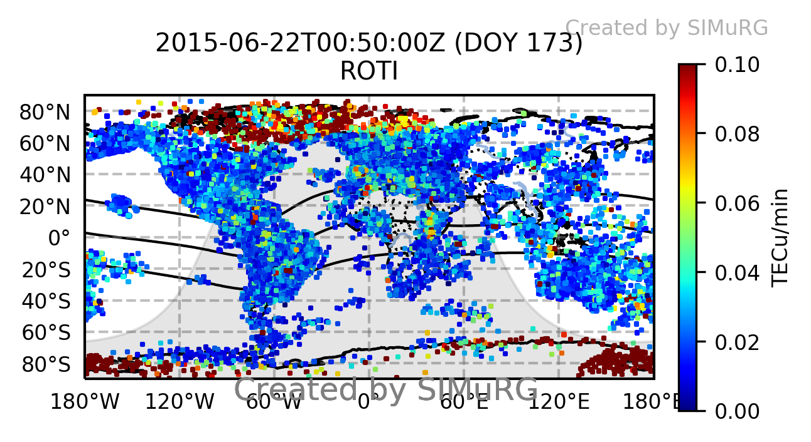
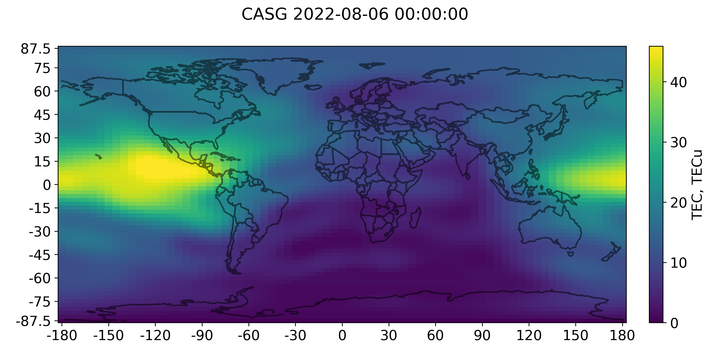
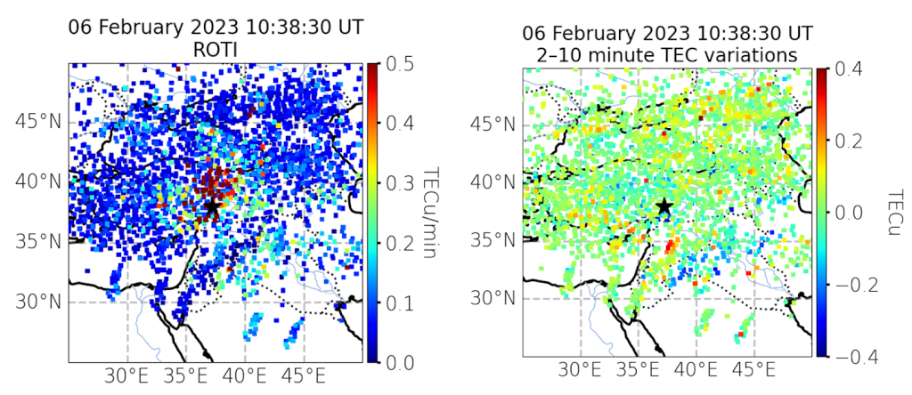
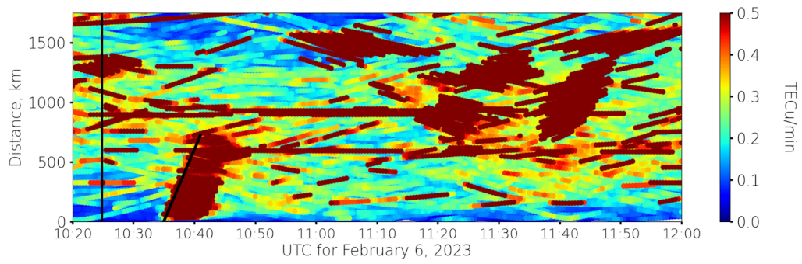
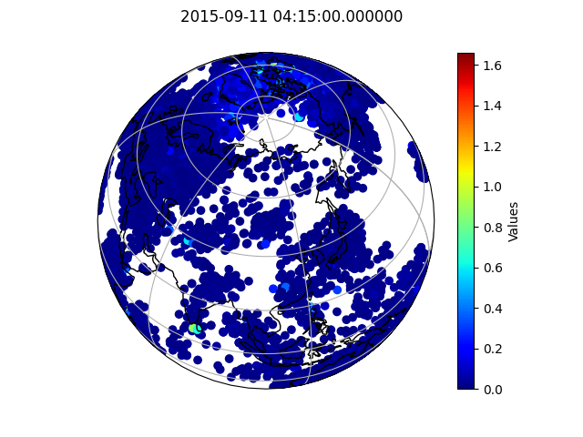

SIMuRG plotter
==============

The collection of the tools to bild global and regional distribution of any 
parameter that can be plotted over the globe (latitude-longitude section) 
or versus height (for example latitude-height and latitude-height section).
The plots include important features such as terminator line, subsolar point,
geomagnetic equator etc.

Features
--------

* Global data plot

* Global map plot

* Regional data plot

* Distance-time plot (under development)

* Round Earth projection (under development)

* Animation plots (under development)

.. image:: docs/gif/animation_plots.gif
   :width: 400
   :alt: Animation plots

Installation
------------

Make virtual environment with conda (optional):

.. code-block:: bash

    conda create -n simurg_plotter python=3.10
    conda deactivate
    conda activate simurg_plotter

Install `poetry`:

.. code-block:: bash

    pip install poetry

Install project:

.. code-block:: bash

    poetry install

Support
-------

If you are having issues, please let us know.
We have a mailing list located at: artemvesnin@gmail.com

License
-------

The project is licensed under the MIT license.
